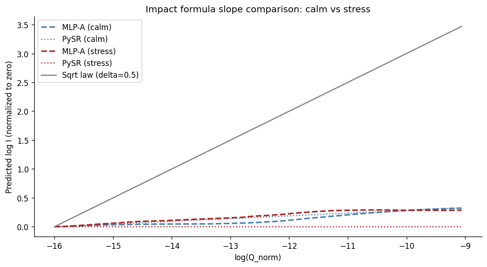
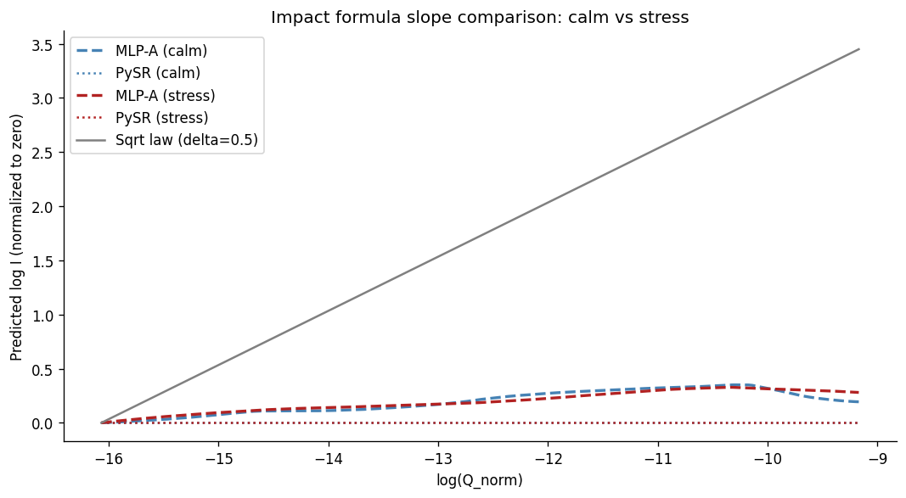

# Market Impact in Crypto: Does the Equity Model Apply?

The question: does the functional form of crypto market impact match the equity model, or does the data support a different structure? Does the answer change across assets or market regimes?

The square-root law of market impact, I(Q) proportional to sqrt(Q), is the standard model used in equity execution. This project asks whether the functional form of crypto impact matches that model across two assets (BTC/USDT and ETH/USDT) and two market regimes (calm and stress).

Using public Binance aggTrades data and the metaorder reconstruction algorithm of Maitrier, Loeper & Bouchaud (2025), we reconstruct synthetic metaorders from individual trades, train a neural network on the impact function in each asset-regime combination, and use symbolic regression to extract the formula the network learned.

## Results

**Key findings:**

- The square-root law is absent in all four experiments: OLS delta ranges 0.098–0.129 and MLP local slope ranges 0.026–0.042 across both assets and both regimes, both far from the theoretical 0.5.
- The effective size contribution to impact is stable at ~0.04–0.06 across all PySR formulas regardless of asset, regime, or functional form, which points to a genuinely shallow size-impact relationship rather than a measurement artifact.
- A nonlinear model on the same three features as Almgren-Chriss (log_Q, log_sigma, log_V) does not improve on linear OLS; adding metaorder length and time-of-day does, beating Almgren-Chriss in all four experiments.
- Volatility dominates size in every model and every regime, but the functional form of the sigma term in the extracted formulas changes across regimes and is not stable across PySR random seeds.

The equity sqrt law does not hold on 2025 crypto spot data. The empirical size exponent is ~0.1 across both assets and both regimes, far from the theoretical 0.5. The finding is robust across two assets, two regimes, and two measurement methods (OLS and MLP local slope).

### BTC/USDT, Calm regime (Aug / Sep 2025)

The formula PySR extracts from the trained MLP is:
```
log I ≈ (-5.510 / log_Q) + (log_sigma * -0.692) + -6.879
```

Since log_Q is always negative, the size term `-5.510 / log_Q` is always positive but shrinks as Q grows. The dominant factor is log_sigma. The sqrt law structure is absent.

### BTC/USDT, Stress regime (Nov 2025, market crash)

Sigma rises 2.3x vs calm. The PySR formula changes structurally:
```
log I ≈ (exp(log_sigma / 4.352) * -7.764) + (log_Q * 0.040)
```

The sigma term becomes exponential rather than linear. log_Q enters directly with a small positive coefficient (~0.040). log_V drops out in both BTC regimes.

### ETH/USDT, Calm regime (Aug / Sep 2025)
```
log I ≈ (log_Q * 0.048) + (log_sigma * -0.852) + -6.367
```

Linear sigma, log_Q directly. Size coefficient ~0.048, consistent with BTC in magnitude.

### ETH/USDT, Stress regime (Nov 2025)

Sigma rises 1.3x vs ETH calm (a milder shock than BTC's 2.3x).
```
log I ≈ (log_Q * 0.057) + (10.571 / log_sigma)
```

log_Q enters directly with coefficient ~0.057. Sigma enters as 1/log_sigma. log_V drops out.

### Cross-asset regime comparison

|  | BTC calm | BTC stress | ETH calm | ETH stress |
|---|---|---|---|---|
| OLS delta | 0.100 | 0.129 | 0.102 | 0.098 |
| MLP mean local slope | 0.042 | 0.041 | 0.026 | 0.041 |
| Size coeff (PySR) | ~0.04 | 0.040 | 0.048 | 0.057 |
| Sigma functional form | Linear | Exponential | Linear | 1/log_sigma |
| Matches equity model | No | No | No | No |

OLS delta ranges 0.098–0.129 across all four experiments. MLP local slope ranges 0.026–0.042. The effective size coefficient in PySR formulas is stable at ~0.04–0.06 regardless of whether size enters as log_Q or 1/log_Q. log_V drops out of all four PySR formulas.




*All empirical lines lie in a narrow band near zero slope. The sqrt law reference reaches 3.5 log-units above them at the right edge.*

### Model performance (OOS MSE)

| Model | BTC calm | BTC stress | ETH calm | ETH stress |
|---|---|---|---|---|
| Power law (delta=0.5, constrained) | 1.272 | 0.996 | 1.180 | 0.934 |
| Power law (delta fitted) | 0.909 | 0.689 | 0.936 | 0.680 |
| Almgren-Chriss | 0.661 | 0.573 | 0.625 | 0.543 |
| MLP-A | 0.668 | 0.574 | 0.622 | 0.546 |
| MLP-B | 0.605 | 0.506 | 0.552 | 0.485 |

MLP-A is statistically indistinguishable from or marginally worse than Almgren-Chriss in most experiments: a nonlinear model on the same three features (log_Q, log_sigma, log_V) does not reliably improve on linear OLS. MLP-B beats Almgren-Chriss in all four experiments; n_child and utc_hour add predictive value that the standard three features do not capture.

## Prior work

Donier & Bonart (2014) confirm the sqrt law on Bitcoin/USD using a complete dataset with real trader IDs. This project finds no evidence of it on 2025 BTC/USDT or ETH/USDT data. The two results are not directly comparable: their market had near-zero statistical arbitrage and no institutional participation; the 2025 market has substantially higher volume, professional market makers, and continuous arbitrage with perpetual futures. Whether the difference reflects genuine market structure change or reconstruction quality without ground-truth trader IDs cannot be determined from this data alone.

## Methodology

Binance does not provide trader IDs, so metaorders cannot be observed directly. We reconstruct synthetic metaorders using the algorithm of Maitrier, Loeper & Bouchaud (2025, arXiv:2503.18199), which assigns synthetic trader IDs to individual trades and groups consecutive same-sign trades per trader into metaorders.

Three models are compared in each asset-regime combination:
1. OLS benchmarks (power law, Almgren-Chriss)
2. MLP trained on metaorder features (MLP-A: standard features; MLP-B: extended features)
3. Closed-form formula extracted from MLP-A via PySR symbolic regression

## Setup
```bash
git clone https://github.com/SLMolenaar/price-impact-research
cd price-impact-research
pip install -r requirements.txt
```

## Reproducing the data pipeline
```bash
# Step 1: download aggTrades from data.binance.vision
# Set SYMBOL and MONTHS in fetch_data.py before running
python src/fetch_data.py

# Step 2: compute impact and rolling features
python src/process_data.py

# Step 3: reconstruct synthetic metaorders (Maitrier et al. 2025)
python src/reconstruct_metaorders.py

# Step 4: open notebooks in order
jupyter lab
```

For the stress regime, set `MONTHS = ["2025-11"]` in `fetch_data.py` and `process_data.py` and save the output with a `_stress` suffix before running `05_stress.ipynb`. For ETH, set `SYMBOL = "ETHUSDT"` and update output paths accordingly (see code comments).

## Notebooks

| Notebook | Contents |
|---|---|
| `01_data.ipynb` | Data checks, individual trade baseline, metaorder reconstruction |
| `02_benchmark.ipynb` | OLS benchmarks, calm regime |
| `03_mlp.ipynb` | MLP-A and MLP-B, calm regime |
| `04_interpretability.ipynb` | Sensitivity analysis, PySR symbolic regression, calm regime |
| `05_stress.ipynb` | Full pipeline repeat on stress regime |
| `06_results.ipynb` | Comparison tables, Diebold-Mariano tests, final figures |

Run each notebook twice, once for BTC and once for ETH, updating the data paths at the top of each notebook.

## Data

Downloaded from [data.binance.vision](https://data.binance.vision). Free, no account required. Not included in this repo.

**BTC/USDT calm:** Aug and Sep 2025. 44.4M trades, 921K reconstructed metaorders. sigma_daily mean ~0.006.

**BTC/USDT stress:** Nov 2025 (market crash, -36% from ATH). 920K reconstructed metaorders. sigma_daily mean ~0.013 (2.3x calm).

**ETH/USDT calm:** Aug and Sep 2025. 79.0M trades, 1.76M reconstructed metaorders. sigma_daily mean ~0.017.

**ETH/USDT stress:** Nov 2025. 925K reconstructed metaorders. sigma_daily mean ~0.023 (1.3x calm).

## Limitations

- Two assets, two months each. Not enough to generalize.
- sigma_daily has near-categorical variation (one value per day), limiting reliable estimation of the volatility-impact relationship. This likely drives the anomalous negative beta in the Almgren-Chriss model across all experiments.
- No ground-truth trader IDs. The reconstruction produces synthetic metaorders whose size distribution may not reflect real institutional flow, particularly on retail-dominated spot markets.
- The PySR sigma functional form is not stable across random seeds. The size finding (~0.04–0.06 effective coefficient) is stable; the exact sigma term is not.
- Crypto microstructure differs from equities in ways that make direct comparison to the equity literature approximate.

## References

- Donier & Bonart (2014). *A million metaorder analysis of market impact on the Bitcoin.* arXiv:1412.4503
- Maitrier, Loeper & Bouchaud (2025). *Generating realistic metaorders from public data.* arXiv:2503.18199
- Sato & Kanazawa (2024). *Strict universality of the square-root law.* arXiv:2411.13965
- Almgren & Chriss (2001). *Optimal execution of portfolio transactions.* Journal of Risk.
- Bouchaud, Farmer & Lillo (2009). *How markets slowly digest changes in supply and demand.*