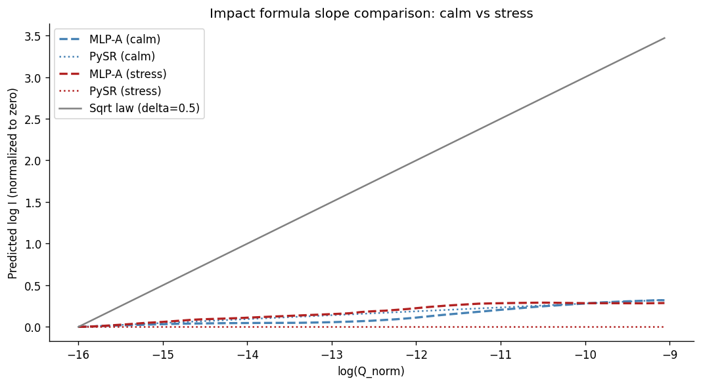
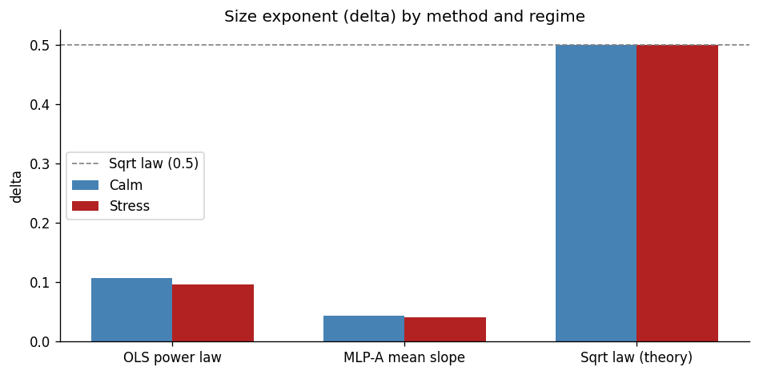
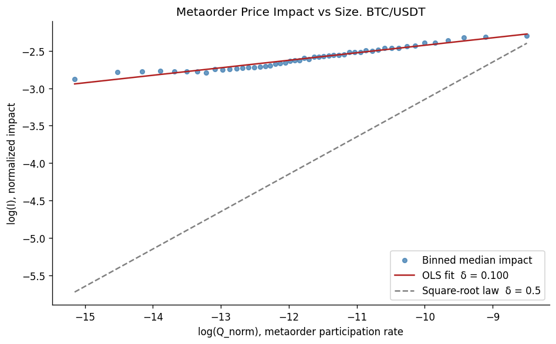

# Market Impact in Crypto: Does the Equity Model Apply?

The question: does the functional form of crypto market impact match the equity model, or does the data support a different structure? Does the answer change across market regimes?

The square-root law of market impact, I(Q) proportional to sqrt(Q), is the standard model used in equity execution. This project asks whether the functional form of crypto impact matches that model, and whether the answer changes across market regimes.

Using public Binance BTC/USDT trade data and the metaorder reconstruction algorithm of Maitrier, Loeper & Bouchaud (2025), we reconstruct synthetic metaorders from individual trades, train a neural network on the impact function in two market regimes, and use symbolic regression to extract the formula the network learned in each case.

## Results

The equity sqrt law does not hold on 2025 BTC/USDT in either regime. The empirical size exponent is ~0.1 in both calm and stress conditions, far from the theoretical 0.5. The functional form differs between regimes, but not in the direction of the equity model.

### Calm regime (Aug / Sep 2025)

The formula PySR extracts from the trained MLP is:

```
log I ≈ (-5.510 / log_Q) + (log_sigma * -0.692) + -6.879
```

Since log_Q is always negative, the size term `-5.510 / log_Q` is always positive but shrinks as Q grows. Larger metaorders have lower normalized impact. The dominant factor is log_sigma. The sqrt law structure is absent.

### Stress regime (Nov 2025, market crash)

Sigma rises 2.3x vs calm. The PySR formula changes structurally:

```
log I ≈ (exp(log_sigma / 4.352) * -7.764) + (log_Q * 0.040)
```

The sigma term becomes exponential rather than linear. log_Q enters directly and positively, but with a small coefficient (~0.040). log_V drops out entirely in both regimes. The sqrt law is absent here too.

### Regime comparison

|  | Calm | Stress |
|---|---|---|
| OLS delta | 0.100 | 0.129 |
| MLP-A mean local slope | 0.042 | 0.041 |
| PySR formula | (-5.510 / log_Q) + (log_sigma * -0.692) + -6.879 | (exp(log_sigma / 4.352) * -7.764) + (log_Q * 0.040) |
| log_Q in formula | Yes (1/log_Q) | Yes (log_Q directly) |
| Sigma functional form | Linear | Exponential |
| Matches equity model | No | No |

OLS delta rose modestly under stress (0.100 to 0.129). The MLP local slope is unchanged (0.042 vs 0.041). The binned OLS relationship steepened; the continuous size-impact function the network learned did not.



*All empirical lines (calm and stress, MLP and PySR) lie in a narrow band near zero slope. The sqrt law reference reaches 3.5 log-units above them at the right edge.*



*OLS delta and MLP mean local slope are stable across regimes and both far below the theoretical 0.5.*

### Model performance (OOS MSE)

| Model | Calm | Stress |
|---|---|---|
| Power law (delta=0.5, constrained) | 1.272 | 0.996 |
| Power law (delta fitted) | 0.909 | 0.689 |
| Almgren-Chriss | 0.661 | 0.573 |
| MLP-A | 0.668 | 0.574 |
| MLP-B | 0.605 | 0.506 |

MLP-A is statistically indistinguishable from Almgren-Chriss in stress (DM test p = 0.089): a nonlinear model on the same three features adds nothing in the high-noise regime. MLP-B beats Almgren-Chriss in both regimes; n_child and utc_hour add predictive value that log_Q, log_sigma, and log_V do not capture.

## Prior work

Donier & Bonart (2014) confirm the sqrt law on Bitcoin/USD using a complete dataset with real trader IDs from 2014, when Bitcoin was a small, illiquid market with near-zero statistical arbitrage. This project uses the Maitrier et al. (2025) reconstruction on 2025 data, where the market structure is fundamentally different: 10x the volume, professional market makers, and continuous arbitrage with perpetual futures. The difference in findings is consistent with genuine market structure differences. Reconstruction quality without ground-truth trader IDs cannot be ruled out as a contributing factor.

## Methodology

Binance does not provide trader IDs, so metaorders cannot be observed directly. We reconstruct synthetic metaorders using the algorithm of Maitrier, Loeper & Bouchaud (2025, arXiv:2503.18199), which assigns synthetic trader IDs to individual trades and groups consecutive same-sign trades per trader into metaorders.

Three models are compared in each regime:
1. OLS benchmarks (power law, Almgren-Chriss)
2. MLP trained on metaorder features
3. Closed-form formula extracted from the MLP via PySR symbolic regression



*Log-log plot of binned median impact vs metaorder size (calm regime). The OLS fit gives delta = 0.100. The sqrt law (delta = 0.5) is shown for reference.*

## Setup

```bash
git clone https://github.com/SLMolenaar/price-impact-research
cd price-impact-research
pip install -r requirements.txt
```

## Reproducing the data pipeline

```bash
# Step 1: download BTC/USDT aggTrades from data.binance.vision
python src/fetch_data.py

# Step 2: compute impact and rolling features
python src/process_data.py

# Step 3: reconstruct synthetic metaorders (Maitrier et al. 2025)
python src/reconstruct_metaorders.py

# Step 4: open notebooks in order
jupyter lab
```

For the stress regime, set `MONTHS = ["2025-11"]` in `fetch_data.py` and `process_data.py` and save the output as `impact_data_stress.parquet` before running `05_stress.ipynb`.

## Notebooks

| Notebook | Contents |
|---|---|
| `01_data.ipynb` | Data checks, individual trade baseline, metaorder reconstruction |
| `02_benchmark.ipynb` | OLS benchmarks, calm regime |
| `03_mlp.ipynb` | MLP-A and MLP-B, calm regime |
| `04_interpretability.ipynb` | Sensitivity analysis, PySR symbolic regression, calm regime |
| `05_stress.ipynb` | Full pipeline repeat on Nov 2025 stress regime |
| `06_results.ipynb` | Comparison tables, Diebold-Mariano tests, final figures |

## Data

Downloaded from [data.binance.vision](https://data.binance.vision). Free, no account required. Not included in this repo.

**Calm regime:** BTC/USDT, Aug and Sep 2025. 44.4M trades, 921K reconstructed metaorders. Low-volatility, sideways market with sigma_daily mean ~0.006.

**Stress regime:** BTC/USDT, Nov 2025 (market crash, -36% from ATH). 920K reconstructed metaorders. Sigma_daily mean ~0.013 (2.3x calm). Processed separately with the same pipeline.

## Limitations

- Single asset over two months. Not enough to generalize.
- sigma_daily has near-categorical variation (one value per day), limiting reliable estimation of the volatility-impact relationship. This likely drives the anomalous negative beta in the Almgren-Chriss model.
- No ground-truth trader IDs. The reconstruction produces synthetic metaorders whose size distribution may not reflect real institutional flow, particularly on retail-dominated spot markets.
- The PySR sigma term is not stable across random seeds in the calm regime (linear vs 1/log_sigma structure across seeds). The size finding is stable; the exact sigma functional form is not.
- Crypto microstructure differs from equities in ways that make direct comparison to the equity literature approximate.

## References

- Donier & Bonart (2014). *A million metaorder analysis of market impact on the Bitcoin.* arXiv:1412.4503
- Maitrier, Loeper & Bouchaud (2025). *Generating realistic metaorders from public data.* arXiv:2503.18199
- Sato & Kanazawa (2024). *Strict universality of the square-root law.* arXiv:2411.13965
- Almgren & Chriss (2001). *Optimal execution of portfolio transactions.* Journal of Risk.
- Bouchaud, Farmer & Lillo (2009). *How markets slowly digest changes in supply and demand.*